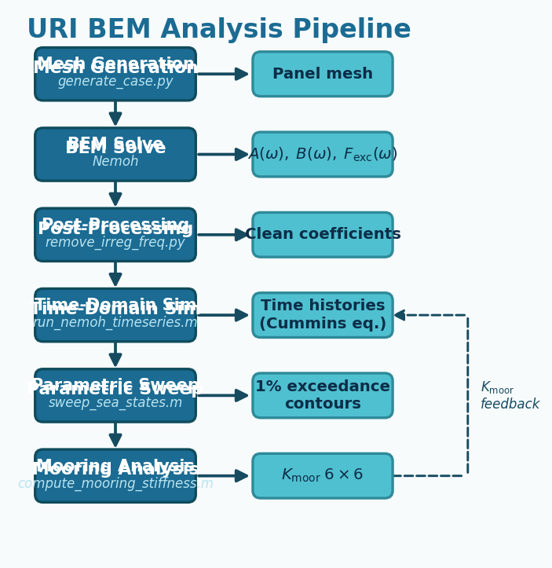

.. URI BEM Analysis Pipeline documentation master file

==========================================
URI BEM Analysis Pipeline
==========================================

**Preliminary hydrodynamic analysis of floating structures using boundary element methods**

   End-to-end pipeline: mesh generation → BEM frequency-domain solve → time-domain simulation → parametric design sweeps.

.. toctree::
   :maxdepth: 2
   :caption: Contents

   introduction
   theory/index
   pipeline/index
   api/index
   examples
   references

Indices and tables
==================

* :ref:`genindex`
* :ref:`search`
