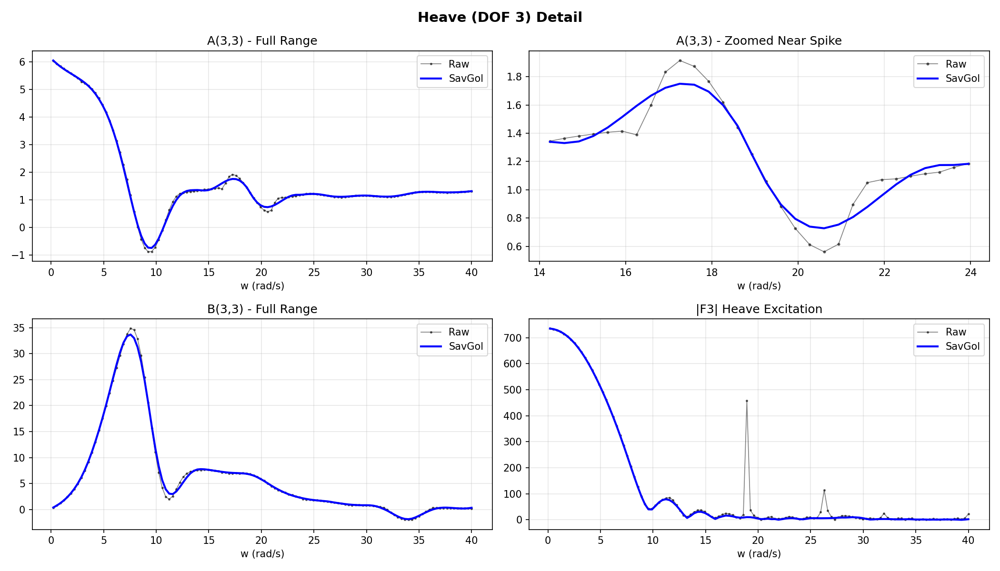
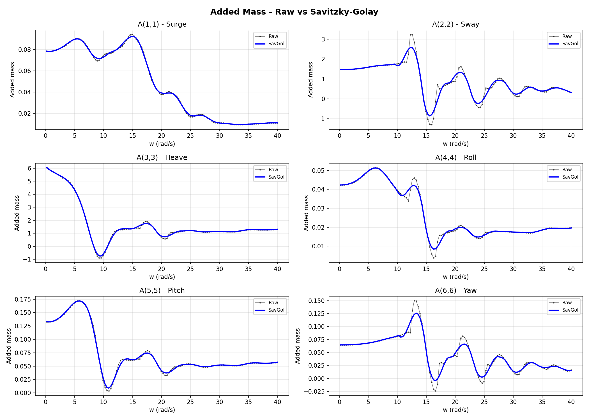

.. _theory-excrad:

========================================
Excitation and Radiation Coefficients
========================================

This chapter details the frequency-domain hydrodynamic coefficients
computed by Nemoh and how they are used in the pipeline.

Added Mass and Radiation Damping
---------------------------------

The radiation force on DOF :math:`i` due to unit-amplitude oscillation
of DOF :math:`j` is characterised by two real, frequency-dependent
coefficients :cite:`Newman1977`:

.. math::
   :label: eq-added-mass

   F_{\text{rad},i}^{(j)}
   = -A_{ij}(\omega)\,\ddot{\eta}_j
   - B_{ij}(\omega)\,\dot{\eta}_j,

where

* :math:`A_{ij}(\omega)` is the **added mass** — the reactive
  (in-phase-with-acceleration) component,
* :math:`B_{ij}(\omega)` is the **radiation damping** — the resistive
  (in-phase-with-velocity) component, always non-negative.

These form :math:`6\times6` matrices at each frequency.  Diagonal
entries dominate for slender bodies; off-diagonal coupling
(e.g. :math:`A_{35}`, heave–pitch) can be significant for asymmetric
geometries.

Infinite-Frequency Added Mass
-----------------------------

As :math:`\omega\to\infty` the radiation damping vanishes and the added
mass approaches a finite limit:

.. math::

   \mathbf{A}_{\infty} = \lim_{\omega\to\infty} \mathbf{A}(\omega).

This matrix appears explicitly in the Cummins equation (:eq:`eq-cummins`)
and is extracted from Nemoh's ``IRF.tec`` output.

Excitation Forces
-----------------

The wave excitation force on DOF :math:`i` for a unit-amplitude incident
wave of frequency :math:`\omega` and direction :math:`\beta` is

.. math::
   :label: eq-fexc-fd

   F_{\text{exc},i}(\omega,\beta)
   = F_{\text{FK},i}(\omega,\beta)
   + F_{\text{D},i}(\omega,\beta),

comprising

* **Froude–Krylov force** :math:`F_{\text{FK}}` — pressure integration
  of the undisturbed incident wave over the body surface,
* **Diffraction force** :math:`F_{\text{D}}` — the additional
  contribution from the scattered wave field.

Nemoh outputs both the magnitude :math:`|F_{\text{exc},i}|` and phase
:math:`\angle F_{\text{exc},i}` (in radians) in
``results/ExcitationForce.tec``.

Nemoh Output Format
-------------------

**Radiation coefficients** (``RadiationCoefficients.tec``):

Each of the six excitation-DOF zones contains columns

.. list-table::
   :header-rows: 1
   :widths: 15 85

   * - Column
     - Content
   * - 1
     - :math:`\omega` (rad/s)
   * - 2–3
     - :math:`A_{i1}(\omega)`, :math:`B_{i1}(\omega)`
   * - 4–5
     - :math:`A_{i2}(\omega)`, :math:`B_{i2}(\omega)`
   * - …
     - …
   * - 12–13
     - :math:`A_{i6}(\omega)`, :math:`B_{i6}(\omega)`

**Excitation force** (``ExcitationForce.tec``):

One zone per wave direction, columns

.. list-table::
   :header-rows: 1
   :widths: 15 85

   * - Column
     - Content
   * - 1
     - :math:`\omega` (rad/s)
   * - 2–3
     - :math:`|F_1|`, :math:`\angle F_1`
   * - 4–5
     - :math:`|F_2|`, :math:`\angle F_2`
   * - …
     - …
   * - 12–13
     - :math:`|F_6|`, :math:`\angle F_6`

Irregular Frequencies
---------------------

At discrete wavenumbers satisfying the interior Dirichlet eigenvalue
problem, the boundary integral equation becomes singular, producing
sharp spikes in :math:`A(\omega)` and :math:`B(\omega)`
:cite:`Malenica1998`.  These **irregular frequencies** are artefacts of
the integral formulation and do not correspond to physical resonances.

   Added mass in heave showing irregular-frequency spikes (raw Nemoh
   output).  The pipeline's ``remove_irreg_freq.py`` script detects
   these spikes and replaces them with smooth interpolants.

   Full added-mass matrix before and after irregular-frequency removal.

The removal algorithm:

1. Computes the second derivative of each coefficient curve.
2. Flags points where the curvature exceeds a threshold (default:
   3× the median absolute deviation).
3. Replaces flagged points by cubic-spline interpolation of the
   surrounding clean data.

.. seealso::

   :cite:`Lee1988` for the lid-panel suppression technique, and
   :ref:`pipeline-nemoh` for how to run the removal script.
